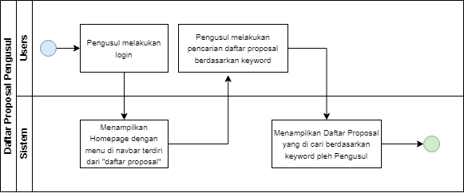

# Project Documentation

### MF BACKOFFICE BATCH 6

### 1. INFORMASI UMUM

#### Person In Change

| Document Owner    | Dimas Ahmad, M. Hilmy, M. Zulkifli, Rian A.P, Husein Alhafiz                             |
| ----------------- | ---------------------------------------------------------------------------------------- |
| Designer          | Novita Rahmadhani                                                                        |
| Developers        | Ahmad Jalu F. N. H, Bintang Rahmatullah, Michael Mervin R, Reza Irvando, Umar Hadi Mukti |
| Quality Assurance | M. Fadly Febrian, M. Ibnu Al Hanif                                                       |
| Delivery Date     | -                                                                                        |
| Sign off Date     | -                                                                                        |

#### Riwayat Revisi

| Author      | Revision Notes  |
| ----------- | --------------- |
| Nama Mentee | Initial Version |
| Nama Mentee | Initial Version |
| Nama Mentee | Initial Version |

#### Petunjuk Instalasi

**Laravel Project Setup Guide**

This guide will walk you through the steps required to set up a Laravel project on your local machine. Laravel is a popular PHP framework for building web applications.

Prerequisites\
Before you begin, make sure you have the following installed on your machine:\
\- required PHP v8.0 or greater\
\- required Composer v2.5.8 or greater\
\- required Node.js v18 (with npm or yarn) or greater\
\- required Git v2.34.1 or greater\
\- optional Docker v25.0.2 or greater

Getting Started

1\. Clone the repository

sh\
git clone "link repository

2\. Navigate to the project directory

sh\
cd "project directory"

3\. Install PHP dependencies using composer

sh\
cd composer install

4\. Copy .env.example to .env

sh\
cp .env.example .env

5\. Generate application key

sh\
php artisan key:generate

6\. Install javascript using npm or yarn

sh\
npm install\
or\
yarn install

7\. Compile assets

sh\
for local development\
npm run dev\
or\
yarn dev

8\. Setup your database configuration file. If your are using docker, you can skip this step.

sh\
DB\_CONNECTION=mysql\
DB\_HOST=127.0.0.1\
DB\_PORT=3306\
DB\_DATABASE=your\_database\_name\
DB\_USERNAME=your\_database\_username\
DB\_PASSWORD=your\_database\_password\

9\. Migrate the database

sh\
php artisan migrate

10\. Serve application

sh\
php artisan serve

Additional Configuration

\- Environment Configuration: Update the .env file as per your environment settings (e.g., APP\_DEBUG, APP\_URL, etc.).\
\- Database Configuration: Modify the database configuration in the .env file according to your requirements.\
\- Cache Configuration: You can configure caching options in the .env file.\
\- Queue Configuration: If your application uses queues, configure the queue driver in the .env file.\

Run Using Docker

For those of u who prefer using docker when serving the application, please follow these steps below:

1\. Follow the prior step until you are at step \[7]\(#7)\
2\. Start the docker container\

sh\
\# run usign docker\
docker compose up -d\
\# or using docker-compose\
docker-compose up -d\

3\. Migrate the database using sail

sh\
./sail artisan migrate

### 2. LATAR BELAKANG

Sebagai bagian dari kerangka kebijakan Merdeka Belajar Kampus Merdeka (MBKM), Kementerian Pendidikan, Kebudayaan, Riset dan Teknologi mengimplementasikan berbagai program untuk membangun ekosistem yang mendorong peningkatan mutu dan relevansi pendidikan tinggi di Indonesia. Termasuk diantaranya adalah penawaran berbagai program pendanaan berbasis kompetisi.

Berbagai data dan informasi di lapangan menunjukkan bahwa sejumlah penelitian yang diselenggarakan di perguruan tinggi telah menghasilkan luaran yang memiliki potensi untuk diterapkan sebagai solusi dari berbagai persoalan di masyarakat atau dikembangkan untuk komersialisasi yang dapat meningkatkan produktivitas dan daya saing nasional. Selain itu, sejumlah perguruan tinggi juga memiliki kepakaran yang mumpuni untuk menjawab berbagai persoalan yang dihadapi sektor swasta maupun Pemerintah yang pada gilirannya akan mendorong peningkatan kinerja dan daya saing nasional

### 3. TUJUAN

Tujuan utama Program Backoffice Kedaireka adalah untuk mendorong terjadinya kerjasama yang saling menguntungkan dan berkelanjutan antara dosen sebagai pihak pengusul dengan dengan mitra sesuai dengan deskripsi masing-masing skema.

### 4. AKTOR

| No | User Category                            | User Main Activity                                                                                                                                                                                  |
| -- | ---------------------------------------- | --------------------------------------------------------------------------------------------------------------------------------------------------------------------------------------------------- |
| 1  | Pengusul                                 | 
Bisa melihat daftar dan detail proposal 2024 Bisa melihat daftar dan detail proposal 2023 Bisa melihat daftar dan detail proposal 2022 Bisa melihat daftar dan detail proposal 2021
 |
| 2  | Tim Reviewer                             | 
Bisa melihat daftar dan detail proposal 2024 Bisa melihat daftar dan detail proposal 2023 Bisa melihat daftar dan detail proposal 2022 Bisa melihat daftar dan detail proposal 2021
 |
| 3  | Unit Pengelola (KUP) di Perguruan Tinggi | 
Bisa melihat daftar dan detail proposal 2024 Bisa melihat daftar dan detail proposal 2023 Bisa melihat daftar dan detail proposal 2022 Bisa melihat daftar dan detail proposal 2021
 |
| 3  | Unit Pengelola (KUP) di Perguruan Tinggi | 
Bisa melihat daftar dan detail proposal 2024 Bisa melihat daftar dan detail proposal 2023 Bisa melihat daftar dan detail proposal 2022 Bisa melihat daftar dan detail proposal 2021
 |
| 4  | Tim Sekretariat                          | 
Bisa melihat daftar dan detail proposal 2024 Bisa melihat daftar dan detail proposal 2023 Bisa melihat daftar dan detail proposal 2022 Bisa melihat daftar dan detail proposal 2021
 |
| 5  | Auditor                                  | 
Bisa melihat daftar dan detail proposal 2024 Bisa melihat daftar dan detail proposal 2023 Bisa melihat daftar dan detail proposal 2022 Bisa melihat daftar dan detail proposal 2021
 |

### 5. FITUR YANG DIKEMBANGKAN

| No | Epic             | Feature                                                                                                                                                                                                                                 |
| -- | ---------------- | --------------------------------------------------------------------------------------------------------------------------------------------------------------------------------------------------------------------------------------- |
| 1  | Perguruan Tinggi | 
Profiling oleh Admin - Daftar Pengusul - Daftar Industri - Total Kolaborasi dengan Industri - Total Pendanaan
                                                                                                        |
| 2  | Mitra            | 
Profiling oleh Admin - Daftar Pengusul - Daftar Proposal - Daftar Mitra - Total Kolaborasi dengan Perguruan Tinggi - Total Pendanaan Login - Daftar Pengusul - Daftar Proposal - Status Pendanaan 
 |
| 3  | Pengusul         | 
Profiling oleh Admin - Daftar Mitra - Total Pendanaan Login - Daftar Proposal - Status Pendanaan 
                                                                                                              |

### 6. DETAIL FITUR

#### 1. DAFTAR PROPOSAL

**Informasi Singkat**

| Target Release    | 1.0                                                                                                   |
| ----------------- | ----------------------------------------------------------------------------------------------------- |
| Epic              | Pengusul                                                                                              |
| Short Explanation | Fitur yang digunakan oleh pengusul setelah login supaya dapat melihat Daftar Proposal yang diinginkan |
| Document Status   | Draft                                                                                                 |

<figure><figcaption></figcaption></figure>

#### REQUIREMENT

| No | User Story                                                                                             | Priority  | Notes                                                                                                                       |
| -- | ------------------------------------------------------------------------------------------------------ | --------- | --------------------------------------------------------------------------------------------------------------------------- |
| 1  | 
As a Mitra I Want Search category as user So I Can search and acces every Mitra features
  | Must Have | 
Form filter mitra sebagai berikut 1. Filter kategori Mitra* 2. Filter Bidang* 3. Filter Pengajuan Proposal*
 |
| 2  | 
As a Admin I Want Search category as Admin So I Can search and acces every Admin features
 | Must Have | 
Form filter mitra sebagai berikut 1. Filter kategori Mitra* 2. Filter Bidang* 3. Filter Pengajuan Proposal*
 |

#### SCENARIO

| No | Scenario                                                                                                               | Type    | Description                                                               | Validation |
| -- | ---------------------------------------------------------------------------------------------------------------------- | ------- | ------------------------------------------------------------------------- | ---------- |
| 1  | 
As a Mitra Ikomerz Ilmu Komputer IPB I want login as mitra So i can search and acces every mitra features
 | Postive | Mitra Ikomerz Ilmu Komputer IPB mendapatkan hasil pencarian sesuai filter | content    |

#### USER INTERFACE & DESIGN

| Description | Login                    |
| ----------- | ------------------------ |
| Login Page  | Image                    |
| Link figma  | ini ceritanya link figma |
|             |                          |

#### 2. FIELD PENCARIAN

**Informasi Singkat**

| Target Release    | 1.0                                                                                   |
| ----------------- | ------------------------------------------------------------------------------------- |
| Epic              | Mitra                                                                                 |
| Short Explanation | Fitur untuk user/mitra dapat melakukan pencarian berdasarkan kriteria yang diinginkan |
| Document Status   | Draft                                                                                 |

#### REQUIREMENT

| No | User Story                                                                                             | Priority  | Notes                                                                                                                       |
| -- | ------------------------------------------------------------------------------------------------------ | --------- | --------------------------------------------------------------------------------------------------------------------------- |
| 1  | 
As a Mitra I Want Search category as user So I Can search and acces every Mitra features
  | Must Have | 
Form filter mitra sebagai berikut 1. Filter kategori Mitra* 2. Filter Bidang* 3. Filter Pengajuan Proposal*
 |
| 2  | 
As a Admin I Want Search category as Admin So I Can search and acces every Admin features
 | Must Have | 
Form filter mitra sebagai berikut 1. Filter kategori Mitra* 2. Filter Bidang* 3. Filter Pengajuan Proposal*
 |

#### SCENARIO

| No | Scenario                                                                                                               | Type    | Description                                                               | Validation |
| -- | ---------------------------------------------------------------------------------------------------------------------- | ------- | ------------------------------------------------------------------------- | ---------- |
| 1  | 
As a Mitra Ikomerz Ilmu Komputer IPB I want login as mitra So i can search and acces every mitra features
 | Postive | Mitra Ikomerz Ilmu Komputer IPB mendapatkan hasil pencarian sesuai filter | content    |

#### USER INTERFACE & DESIGN

| Description | Login                    |
| ----------- | ------------------------ |
| Login Page  | Image                    |
| Link figma  | ini ceritanya link figma |

\
